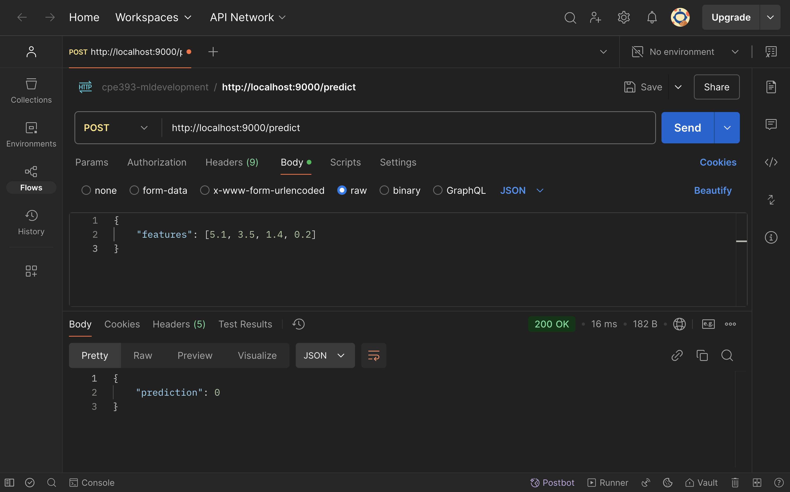
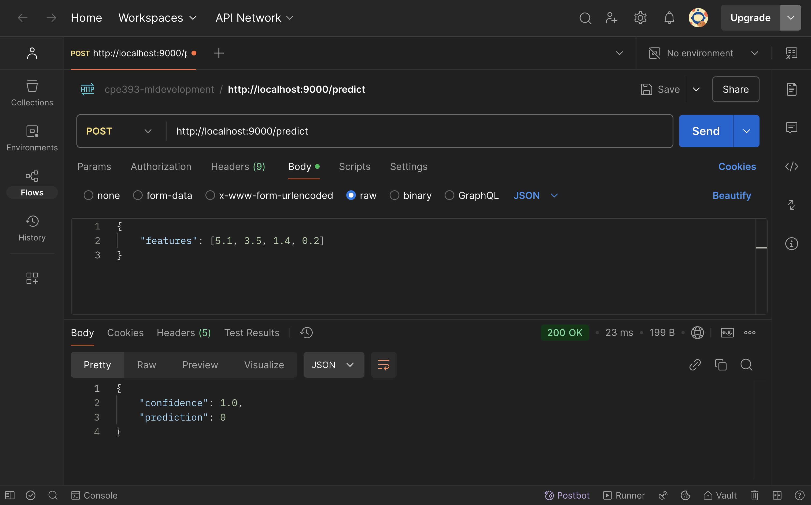
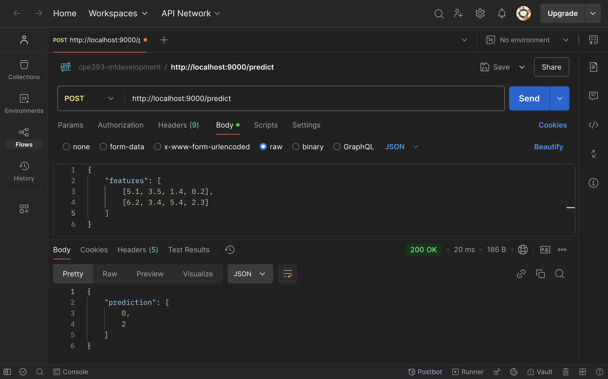
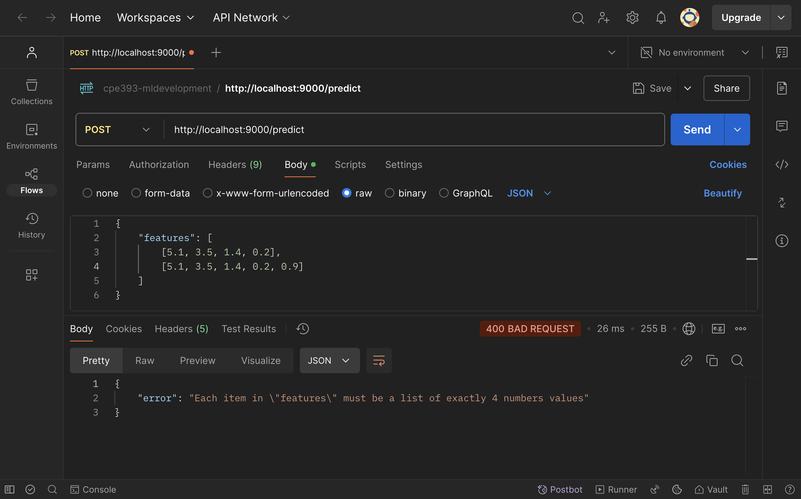
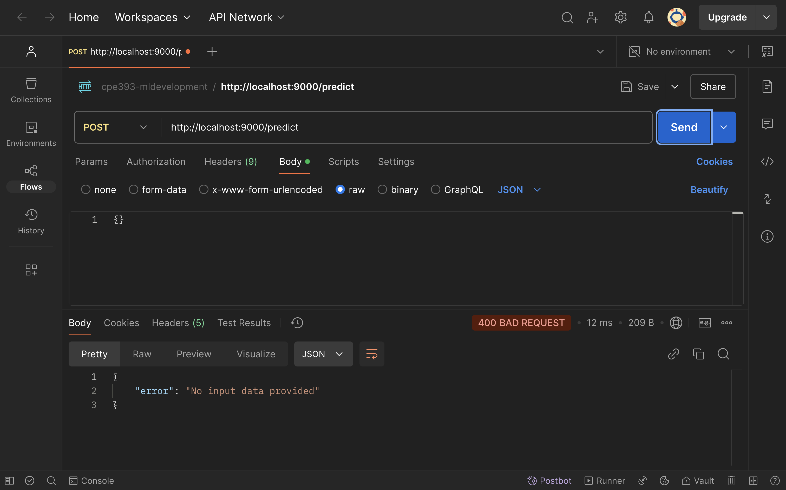
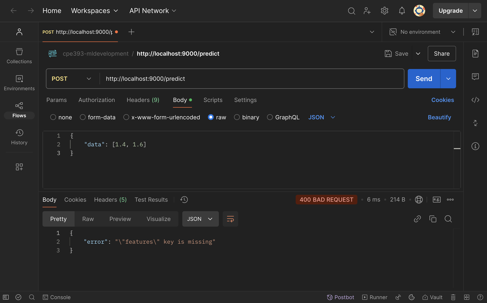
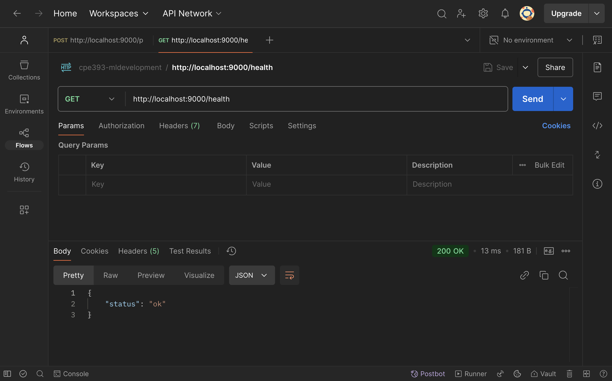

# **CPE393 ML DEPLOYMENT LAB**

## ⚙️ Setup Project

**Model Export** - Run `iris_train.py` (`iris_model.pkl` will be saved in models folder)
```
python scripts/iris_train.py
```

**Build Docker image**
```
docker build -t ml-model .
```

**Run Docker container**
```
docker run -p 9000:9000 ml-model
```

**Test the API in new terminal or Postman**
```
curl -X POST http://localhost:9000/predict \
     -H "Content-Type: application/json" \
     -d '{"features": [5.1, 3.5, 1.4, 0.2]}'
```

**Expected output**
```json
{
     "prediction": 0
}
```

**Output Screenshot**
> 


## ✅ Exercise 1: Add Confidence Scores
> **Task**: Update the `/predict` endpoint to return the prediction and the confidence score using `predict_proba()`

**Expected Output Example:**
```json
{
  "prediction": 0,
  "confidence": 0.97
}
```

**Updated Function**
```python
@app.route("/predict", methods=["POST"])
def predict():
    data = request.get_json()
    input_features = np.array(data["features"]).reshape(1, -1)
    
    prediction = iris_model.predict(input_features)[0]
    proba = iris_model.predict_proba(input_features)[0]     # Added: Predict confidence
    confidence = float(np.max(proba))                       # Added: Extract the highest confidence of the predicted class
    
    return jsonify({
        "prediction": int(prediction),
        "confidence": round(confidence, 2)                  # Added: Round decimals
    })
```

**Output Screenshot**
> 


## ✅ Exercise 2: Handle Multiple Inputs
> **Task** - Allow the `/predict` endpoint to accept a list of inputs.

**Input Example:**
```json
{
  "features": [
    [5.1, 3.5, 1.4, 0.2],
    [6.2, 3.4, 5.4, 2.3]
  ]
}
```

**Expected Output Example:**
```json
{
  "predictions": [0, 2]
}
```

**Updated Function**
```python
@app.route("/predict", methods=["POST"])
def predict():
    data = request.get_json()
    input_features = np.array(data["features"])             # Fixed: Convert feature list into NumPy array 
    predictions = iris_model.predict(input_features)        # Fixed: Batch prediction
    return jsonify({ "prediction": predictions.tolist() })  # Fixed: Convert NumPy array back to list
```

**Output Screenshot**
> 


## ✅ Exercise 3: Add Input Validation

> **Task** - Ensure that:
> - The "features" key exists
> - Each input has exactly 4 float values
> - Invalid input returns a clear error message with HTTP 400

**Updated Function**
```python
@app.route("/predict", methods=["POST"])
def predict():
     data = request.get_json()

     # Added: Check if request has no JSON data
     if not data:
          return jsonify({ "error": "No input data provided" }), 400

     # Added: Check if "features" key is missing in the request
     if "features" not in data:
          return jsonify({ "error": '"features" key is missing' }), 400

     # Added: Validate that "features" is a list of lists with exactly 4 numeric values each
     features = data["features"]
     if not isinstance(features, list) or not all(
          isinstance(row, list) and len(row) == 4 and all (isinstance(x, (int, float)) for x in row)
          for row in features
     ):
          return jsonify({ "error": 'Each item in "features" must be a list of exactly 4 numbers values' }), 400

     input_features = np.array(features)
     predictions = iris_model.predict(input_features)
     return jsonify({ "prediction": predictions.tolist() })
```

**Output Screenshot**
> 
> *Figure 1: Exercise 3 - Valid Input*

> 
> *Figure 2: Exercise 3 - Invalid (Non-numeric value)*

> 
> *Figure 3: Exercise 3 - Invalid (Too many values)*

> 
> *Figure 4: Exercise 3 - Invalid (Too few values)*

> 
> *Figure 5: Exercise 3 - Invalid (Empty request body)*

> 
> *Figure 6: Exercise 3 - Invalid (Missing "features" key)*


## ✅ Exercise 4: Add Health Check Endpoint
> **Task** - Add an endpoint `/health` that returns a simple JSON indicating the API is live

**Expected Output Example:**
```json
{
  "status": "ok"
}
```

**Added Function**
```python
# Added: Define a health check endpoint at /health
@app.route("/health", methods=["GET"])
def health_check():
     return jsonify({ "status": "ok" }), 200
```

**Output Screenshot**
> 