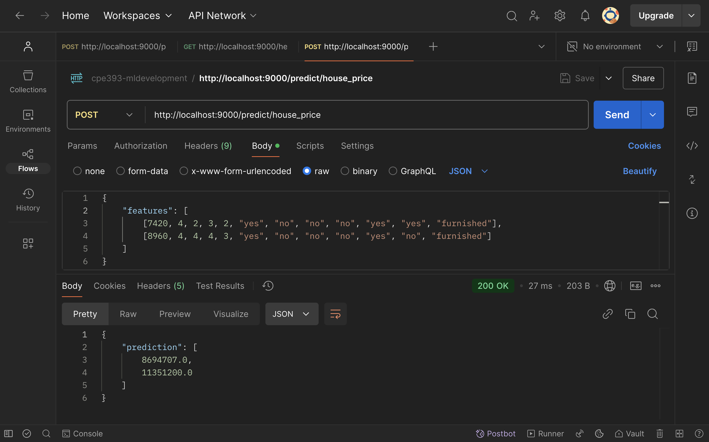
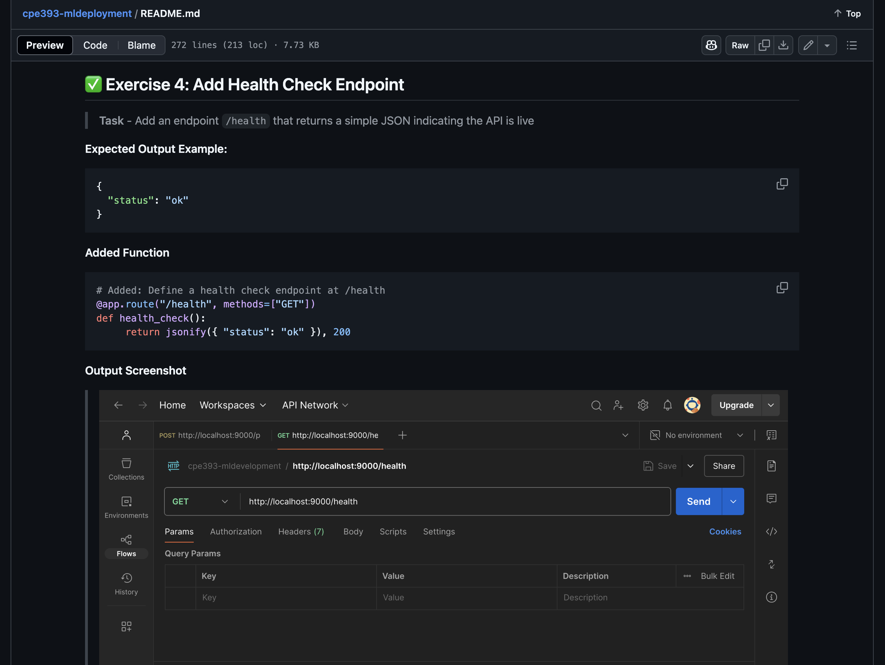

# **CPE393 ML DEPLOYMENT LAB**
This project is part of the **CPE393 Machine Learning Deployment Lab**, focused on deploying machine learning models using Python, Flask, and Docker. The project demonstrates how to build, train, and serve ML models via RESTful APIs.

## 🌟 Key Features
- Iris Classification Model
     - Trained using `scikit-learn`
     - Exposes a `/predict/iris` endpoint for Iris classification
     - Handles single or batch input with validation
- Housing Price Prediction Model
     - Trained on `housing_dataset.csv` using `RandomForestRegressor`
     - Exposes a `/predict/house_price` endpoint for predicting housing prices
     - Supports categorical and numerical features via preprocessing pipeline
     - Accepts batch inputs and validates format
- Health Check
     - `/health` endpoint to verify the service is running

## 📬 Available Endpoints
|        Endpoint        | Method |              Description              |
|------------------------|--------|---------------------------------------|
| `/health`              |  GET   | Health check to verify API is running |
| `/predict/iris`        |  POST  | Predict Iris flower class             |
| `/predict/house_price` |  POST  | Predict housing price                 |

## 🛠️ Tech Stack
- Python, Flask, scikit-learn
- Docker for containerization
- Postman / cURL for testing
- One-hot encoding + scaling via `Pipeline`

## 📁 Project Structure
```
CPE393-MLDEPLOYMENT/
├── app/
│   └── app.py                   # Flask application with API endpoints
├── data/
│   └── housing_dataset.csv      # Dataset for housing price prediction
├── homework/
│   └── homework.md              # Homework-related notes or exercises
├── images/
│   └── *.png                    # Screenshots for README and exercises
├── models/
│   ├── iris_model.pkl           # Trained model for iris classification
│   └── housing_model.pkl        # Trained model for housing price regression
├── scripts/
│   ├── iris_train.py            # Training script for iris model
│   └── housing_train.py         # Training script for housing model
├── .gitignore                   # Git ignored files
├── Dockerfile                   # Docker configuration file
├── LICENSE                      # License info
├── README.md                    # Project documentation
└── requirements.txt             # Python dependencies
```

## ⚙️ Setup Project
**1. Install packages listed in a `requirements.txt` file**
```
pip install -r requirements.txt
```

**2. Model Export** - Run `iris_train.py` (`iris_model.pkl` will be saved in models folder)
```
python scripts/iris_train.py
```

**3. Build Docker image**
```
docker build -t ml-model .
```

**4. Run Docker container**
```
docker run -p 9000:9000 ml-model
```

**5. Test the API in new terminal or Postman**
```
curl -X POST http://localhost:9000/predict \
     -H "Content-Type: application/json" \
     -d '{"features": [5.1, 3.5, 1.4, 0.2]}'
```

**Expected output**
```json
{
     "prediction": 0
}
```

**Output Screenshot**
> 


## ✅ Exercise 1: Add Confidence Scores
> **Task**: Update the `/predict` endpoint to return the prediction and the confidence score using `predict_proba()`

**Expected Output Example:**
```json
{
  "prediction": 0,
  "confidence": 0.97
}
```

**Updated Function**
```python
@app.route("/predict", methods=["POST"])
def predict():
    data = request.get_json()
    input_features = np.array(data["features"]).reshape(1, -1)
    
    prediction = iris_model.predict(input_features)[0]
    proba = iris_model.predict_proba(input_features)[0]     # Added: Predict confidence
    confidence = float(np.max(proba))                       # Added: Extract the highest confidence of the predicted class
    
    return jsonify({
        "prediction": int(prediction),
        "confidence": round(confidence, 2)                  # Added: Round decimals
    })
```

**Output Screenshot**
> 


## ✅ Exercise 2: Handle Multiple Inputs
> **Task** - Allow the `/predict` endpoint to accept a list of inputs.

**Input Example:**
```json
{
  "features": [
    [5.1, 3.5, 1.4, 0.2],
    [6.2, 3.4, 5.4, 2.3]
  ]
}
```

**Expected Output Example:**
```json
{
  "predictions": [0, 2]
}
```

**Updated Function**
```python
@app.route("/predict", methods=["POST"])
def predict():
    data = request.get_json()
    input_features = np.array(data["features"])             # Fixed: Convert feature list into NumPy array 
    predictions = iris_model.predict(input_features)        # Fixed: Batch prediction
    return jsonify({ "prediction": predictions.tolist() })  # Fixed: Convert NumPy array back to list
```

**Output Screenshot**
> 


## ✅ Exercise 3: Add Input Validation

> **Task** - Ensure that:
> - The "features" key exists
> - Each input has exactly 4 float values
> - Invalid input returns a clear error message with HTTP 400

**Updated Function**
```python
@app.route("/predict", methods=["POST"])
def predict():
     data = request.get_json()

     # Added: Check if request has no JSON data
     if not data:
          return jsonify({ "error": "No input data provided" }), 400

     # Added: Check if "features" key is missing in the request
     if "features" not in data:
          return jsonify({ "error": '"features" key is missing' }), 400

     # Added: Validate that "features" is a list of lists with exactly 4 numeric values each
     features = data["features"]
     if not isinstance(features, list) or not all(
          isinstance(row, list) and len(row) == 4 and all (isinstance(x, (int, float)) for x in row)
          for row in features
     ):
          return jsonify({ "error": 'Each item in "features" must be a list of exactly 4 numbers values' }), 400

     input_features = np.array(features)
     predictions = iris_model.predict(input_features)
     return jsonify({ "prediction": predictions.tolist() })
```

**Output Screenshot**
> 
> *Figure 1: Exercise 3 - Valid Input*

> 
> *Figure 2: Exercise 3 - Invalid (Non-numeric value)*

> 
> *Figure 3: Exercise 3 - Invalid (Too many values)*

> 
> *Figure 4: Exercise 3 - Invalid (Too few values)*

> 
> *Figure 5: Exercise 3 - Invalid (Empty request body)*

> 
> *Figure 6: Exercise 3 - Invalid (Missing "features" key)*


## ✅ Exercise 4: Add Health Check Endpoint
> **Task** - Add an endpoint `/health` that returns a simple JSON indicating the API is live

**Expected Output Example:**
```json
{
  "status": "ok"
}
```

**Added Function**
```python
# Added: Define a health check endpoint at /health
@app.route("/health", methods=["GET"])
def health_check():
     return jsonify({ "status": "ok" }), 200
```

**Output Screenshot**
> 


## ✅ Exercise 5: Dockerize Your Own Model
> **Task** - Train a new model on a provided housing dataset and deploy it using the same Docker structure. The task is to build a regression model to predict the housing price.

**Create Python script for training the model** - create a `housing_train.py` Python file in `scipts/` folder

**Added Script in a `housing_train.py` file** - Create Random Forest Regressor for house price prediction
```python
import pickle
import pandas as pd
from sklearn.ensemble import RandomForestRegressor
from sklearn.pipeline import Pipeline
from sklearn.model_selection import train_test_split
from sklearn.metrics import mean_squared_error, r2_score
from sklearn.preprocessing import StandardScaler, OneHotEncoder
from sklearn.compose import ColumnTransformer

housing_dataset = pd.read_csv("data/housing_dataset.csv")
X = housing_dataset.drop("price", axis=1)
y = housing_dataset["price"]

categorical_cols = [
    "mainroad", "guestroom", "basement", "hotwaterheating",
    "airconditioning", "prefarea", "furnishingstatus"
]
numerical_cols = [
    "area", "bedrooms", "bathrooms",
    "stories", "parking"
]

preprocessor = ColumnTransformer(transformers=[
    ("num", StandardScaler(), numerical_cols),
    ("cat", OneHotEncoder(drop="first"), categorical_cols)
])

pipeline = Pipeline(steps=[
    ("preprocessor", preprocessor),
    ("regressor", RandomForestRegressor(n_estimators=100, random_state=42))
])

X_train, X_test, y_train, y_test = train_test_split(X, y, test_size=0.2, random_state=42)
pipeline.fit(X_train, y_train)

with open("models/housing_model.pkl", "wb") as f:
    pickle.dump(pipeline, f)
```

**Model Export** - Run `housing_train.py` (`housing_model.pkl` will be saved in models folder)
```
python scripts/housing_train.py
```

**Load Model** - Load `housing_model.pkl` for house price prediction
```python
import pickle

with open("models/housing_model.pkl", "rb") as f:
     housing_model = pickle.load(f)
```

**Create Endpoint** - Create `/predict/house_price` for house price prediction
```python
@app.route("/predict/house_price", methods=["POST"])
def predict_house_price():
     data = request.get_json()

     if not data:
          return jsonify({ "error": "No input data provided" }), 400

     if "features" not in data:
          return jsonify({ "error": '"features" key is missing' }), 400

     features = data["features"]
     if not isinstance(features, list) or not all(
          isinstance(row, list) and len(row) == 12 for row in features
     ):
          return jsonify({ "error": 'Each item in "features" must be a list of exactly 12 values' }), 400

     column_names = [
          "area", "bedrooms", "bathrooms", "stories", "parking", "mainroad", "guestroom",
          "basement", "hotwaterheating", "airconditioning", "prefarea", "furnishingstatus"
     ]
     df = pd.DataFrame(features, columns=column_names)
     predictions = housing_model.predict(df)
     return jsonify({ "prediction": predictions.tolist() })
```

**Output Screenshot**
> 


## ✅ Exercise 6: Write a README
> **Task** - Create a `README.md` that includes:
> - Project description
> - Setup steps
> - Sample API request and response

**Output Screenshot**
> 
> *This `README.md` is the documentation for project description, setup steps, and sample API request and response screenshot from Postman*